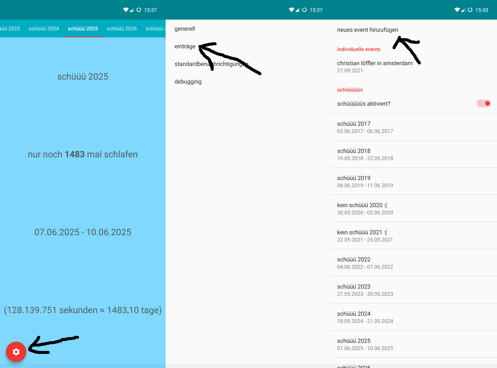
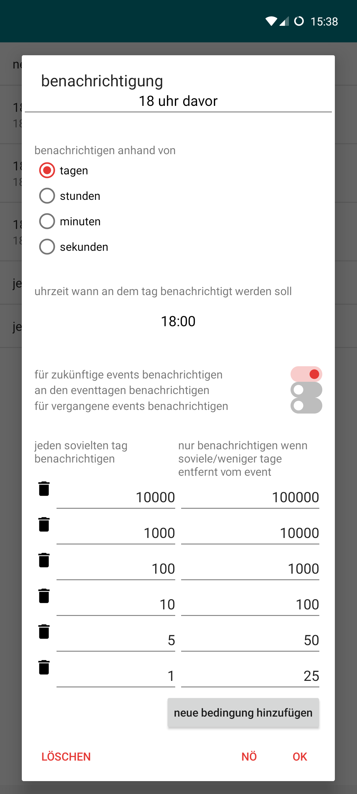

# hallo

das ist die offizielle fb spiele schüüü (und andere sachen) timer app für countdowns und so

# funktionen
* die zeit bis zu/seit den events anzeigen
* benachrichtungen für die events machen
* einen schnellzugriff um spontan angezeigt zu bekommen wann das nächste schüüü is
  * und kopiert es als hashtag in die zwischenablage

# hilfe
## neues event hinzufügen

die events werden automatisch gespeichert

## benachrichtigungsdialog

die benachrichtigung im screenshot ergibt:

* in den letzten 25 tagen vor dem event jeden tag um 18:00 uhr eine benachrichtigung
* zwischen 25 und 50 tagen vor dem event jeden 5. tag um 18:00 uhr eine benachrichtigung
* ...

# berechtigungen und datenschutz
die app benötigt nur eine berechtigungen und sendet keine daten zu mir oder so alles is auf dem handy gespeichert und ich kann davon nix sehen

### berechtigung neustart
die app muss wissen wann das handy neugestartet wurde um nach dem neustart die nächsten benachrichtigungen zu berechnen und dann wenn sie benachrichtigen anzeigen muss an die benachrichtigung erinnert wird. je nach handy kann es sein dass die berechtigung automatisch (bei fast allen) gegeben wird und manchmal auch garnicht in den berechtigungen angezeigt wird. theoretisch kann die berechtigung auch nicht gegeben werden, dann bekommst du halt keine benachrichtigungen nach dem neustart bis du die app ein mal geöffnet hast.

### berechtigung schnellzugriff verbinden
um den schnellzugriffsbutton mit dem nächsten schüüü zu machen muss die app das schnellzugriffsicon dafür koppeln können. die berechtigung ist eigentlich auch automatisch gegeben und wird wahrscheinlich auch nicht angezeigt weil sie fast selbstverständlich ist. wenn du die berechtigung ausschaltest kannst du das schnellzugriffsicon halt nicht mehr sehen und nicht mehr nutzen
